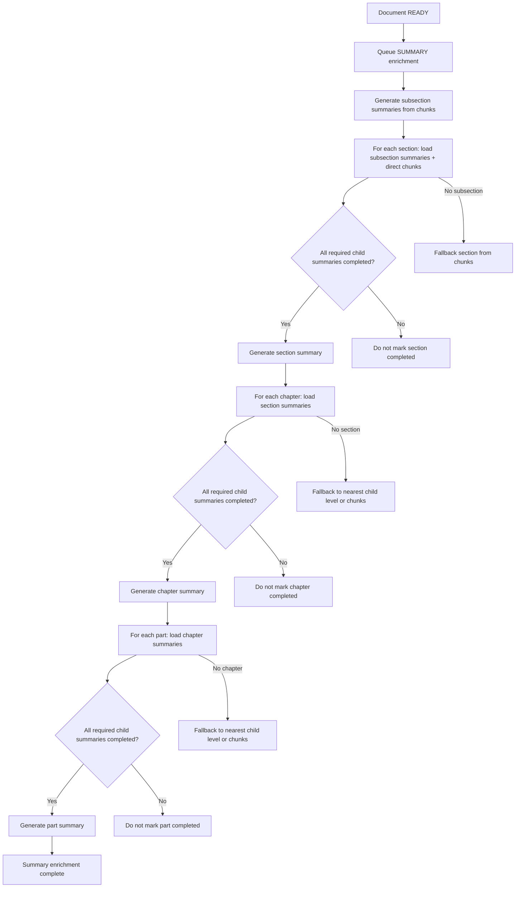

# Hierarchical Bottom-Up Summary Plan

## Mục tiêu

Triển khai luồng summary theo hướng bottom-up để summary cấp cha được tổng hợp từ summary của các cấp con, thay vì lấy toàn bộ raw chunks của subtree rồi cắt theo `max-node-chunks` và `max-node-context-chars`.

Luồng mục tiêu:

1. Tạo summary cho `subsection`.
2. Tạo summary cho `section` từ summary các `subsection` + một số chunks trực tiếp thuộc `section`.
3. Tạo summary cho `chapter` từ summary các `section`.
4. Tạo summary cho `part` từ summary các `chapter`.

Yêu cầu quan trọng: không mark artifact summary cấp cha là `COMPLETED` nếu thiếu summary con bắt buộc.

## Quyết định đã chốt

- `section` summary dùng summary của các `subsection` và vài chunks trực tiếp thuộc `section`, để vẫn bao phủ phần nội dung mở đầu/kết luận của section nếu tài liệu có text nằm trực tiếp dưới section.
- Nếu tài liệu thiếu cấp con chuẩn, dùng fallback theo cấp con gần nhất có sẵn. Ví dụ:
  - `chapter` không có `section` thì dùng `subsection`, nếu không có nữa thì dùng chunks.
  - `part` không có `chapter` thì dùng `section`, rồi `subsection`, rồi chunks.
- Độ dài summary theo cấp:
  - `subsection`: một đoạn ngắn.
  - `section`: 2-4 ý chính.
  - `chapter`: 5-8 ý chính.
  - `part`: overview ngắn + mỗi chương chính một đoạn ngắn.
- Có thể đổi định dạng `SUMMARY` JSON, không cần giữ response/API tương thích tuyệt đối với định dạng cũ.
- Nếu child summary fail hoặc thiếu, không mark parent summary là `COMPLETED`.
- Frontend/API hiện tại không cần giữ tương thích tuyệt đối, nhưng vẫn nên giữ field `summary` chính để chat render đơn giản.

## Vấn đề của cách hiện tại

Hiện tại summary lấy recursive chunks cho một node rồi giới hạn bằng:

- `application.rag.enrichment.max-node-chunks`
- `application.rag.enrichment.max-node-context-chars`

Với `chapter` hoặc `part` lớn, phần cuối nội dung có thể không được đưa vào prompt. Artifact vẫn có thể `COMPLETED`, nhưng summary không đảm bảo bao phủ toàn bộ nội dung.

## Thiết kế dữ liệu

### Summary mode

Thêm enum/service-level mode:

```java
enum SummaryMode {
    SUBSECTION_FROM_CHUNKS,
    SECTION_FROM_SUBSECTIONS_AND_DIRECT_CHUNKS,
    SECTION_FROM_CHUNKS_FALLBACK,
    CHAPTER_FROM_SECTIONS,
    CHAPTER_FALLBACK,
    PART_FROM_CHAPTERS,
    PART_FALLBACK
}
```

### Summary generation context

Tạo context riêng cho summary:

```java
record SummaryGenerationContext(
    Document document,
    DocumentNode node,
    SummaryMode summaryMode,
    List<DocumentChunk> directChunks,
    List<ChildSummary> childSummaries,
    SummaryCoverage coverage
) {}
```

```java
record ChildSummary(
    Long nodeId,
    String nodeType,
    String title,
    String sectionPath,
    Long artifactId,
    String sourceHash,
    String summary,
    List<Map<String, Object>> citations
) {}
```

```java
record SummaryCoverage(
    int expectedChildCount,
    int usedChildCount,
    List<Long> missingChildNodeIds,
    int directChunkCount,
    int usedDirectChunkCount,
    boolean complete
) {}
```

## Định dạng SUMMARY JSON mới

Ví dụ artifact `SUMMARY`:

```json
{
  "nodeTitle": "Chương 1",
  "sectionPath": "Phần I > Chương 1",
  "nodeType": "chapter",
  "summaryMode": "CHAPTER_FROM_SECTIONS",
  "summary": "Nội dung summary render chính...",
  "keyPoints": [
    "Ý chính 1",
    "Ý chính 2"
  ],
  "childSummaries": [
    {
      "nodeId": 101,
      "nodeType": "section",
      "title": "1.1 ...",
      "sectionPath": "Chương 1 > 1.1 ...",
      "summary": "Tóm tắt ngắn của section..."
    }
  ],
  "childSummaryRefs": [
    {
      "nodeId": 101,
      "artifactId": 9001,
      "sourceHash": "..."
    }
  ],
  "citations": [
    {
      "chunkId": 123,
      "pageFrom": 1,
      "pageTo": 2
    }
  ],
  "coverage": {
    "expectedChildCount": 5,
    "usedChildCount": 5,
    "missingChildNodeIds": [],
    "directChunkCount": 2,
    "usedDirectChunkCount": 2,
    "complete": true
  },
  "generated": true
}
```

Ghi chú:

- `summary` vẫn là field chính để chatbot render.
- `keyPoints` dùng cho `section/chapter`; có thể rỗng với `subsection`.
- `childSummaries` giúp debug và có thể phục vụ UI.
- `childSummaryRefs` dùng để trace artifact cha phụ thuộc vào artifact con nào.
- `coverage.complete` phải là `true` mới được lưu `COMPLETED`.

## Luồng sinh summary

### 1. Subsection

Input:

- Chunks trực tiếp của `subsection`.
- Nếu subsection có node con bất thường, có thể dùng recursive chunks trong phạm vi subsection.

Output:

- Một đoạn summary ngắn.
- Citation từ chunks đã dùng.

Rule:

- Nếu không có chunks usable, mark `SKIPPED` hoặc `FAILED` với error rõ ràng.

### 2. Section

Input ưu tiên:

- Completed summary artifacts của direct child `subsection`.
- Một số chunks trực tiếp thuộc `section`, không lấy toàn bộ subtree của subsection.

Fallback:

- Nếu không có subsection, dùng chunks trực tiếp hoặc recursive chunks trong section.

Output:

- 2-4 ý chính.
- Có thể có `keyPoints`.
- Coverage phải ghi đủ số subsection expected/used.

### 3. Chapter

Input ưu tiên:

- Completed summary artifacts của direct child `section`.

Fallback:

- Nếu không có section, dùng completed summaries của cấp con gần nhất:
  - `subsection`
  - nếu không có, dùng chunks fallback.

Output:

- 5-8 ý chính.
- Summary phải thể hiện đủ các section/nhóm nội dung con.

### 4. Part

Input ưu tiên:

- Completed summary artifacts của direct child `chapter`.

Fallback:

- Nếu không có chapter, dùng cấp con gần nhất:
  - `section`
  - `subsection`
  - chunks fallback

Output:

- Overview ngắn.
- Mỗi chương chính một đoạn nội dung ngắn.

## Thứ tự xử lý

Trong auto enrichment sau upload, chỉ chạy `SUMMARY`.

Thứ tự bắt buộc:

```text
subsection -> section -> chapter -> part
```

Pseudo-flow:

```java
generateSummaries(documentId, "subsection");
generateSummaries(documentId, "section");
generateSummaries(documentId, "chapter");
generateSummaries(documentId, "part");
```

Với mỗi node:

1. Resolve summary input theo node type.
2. Kiểm tra child summaries bắt buộc đã `COMPLETED`.
3. Nếu thiếu child summary, không gọi LLM cho parent.
4. Build prompt theo mode.
5. Gọi LLM.
6. Validate JSON + coverage.
7. Lưu artifact `SUMMARY COMPLETED`.

## Repository/API cần bổ sung

Trong `DocumentNodeRepository`:

```java
List<DocumentNode> findByDocumentIdAndNodeTypeOrderByOrderIndexAsc(Long documentId, String nodeType);
List<DocumentNode> findByParentIdOrderByOrderIndexAsc(Long parentId);
List<DocumentNode> findByDocumentIdAndParentIdInOrderByOrderIndexAsc(Long documentId, Collection<Long> parentIds);
```

Trong `DocumentChunkRepository`:

```java
List<DocumentChunk> findByNodeIdOrderBySourceOrderAsc(Long nodeId);
List<DocumentChunk> findByDocumentIdAndNodeIdOrderBySourceOrderAsc(Long documentId, Long nodeId);
```

Trong `DocumentNodeArtifactRepository`:

```java
Optional<DocumentNodeArtifact> findLatestCompletedSummaryByNodeId(Long nodeId);
List<DocumentNodeArtifact> findCompletedSummariesByNodeIds(Collection<Long> nodeIds);
```

## Prompt changes

Tách prompt summary thành:

- `buildLeafSummaryPrompt(...)`
- `buildParentSummaryPrompt(...)`
- `buildSectionSummaryPrompt(...)`
- `buildPartSummaryPrompt(...)`

Prompt parent phải nhấn mạnh:

- Chỉ tổng hợp từ child summaries và direct chunks được cung cấp.
- Không bỏ sót child summary nào.
- Không thêm kiến thức ngoài input.
- Output JSON phải có `coverage`, `childSummaryRefs`, `summaryMode`.

## Validation changes

Mở rộng `DocumentEnrichmentArtifactValidationService` cho `SUMMARY`:

- Validate `summary` không rỗng.
- Validate `summaryMode`.
- Validate `coverage.complete == true` trước khi artifact được `COMPLETED`.
- Validate `expectedChildCount`, `usedChildCount`, `missingChildNodeIds`.
- Validate `childSummaryRefs` khớp với artifacts con đã dùng.
- Validate citations chỉ nằm trong direct chunks được phép nếu mode dùng chunks.

Nếu validation fail:

- Artifact node hiện tại không được `COMPLETED`.
- Ghi `FAILED` với error message rõ.
- Parent của node đó sẽ không được mark `COMPLETED`.

## Config đề xuất

```yaml
application:
  rag:
    enrichment:
      prompt-version: enrichment-v2-bottom-up
      summary-enabled: true
      review-questions-enabled: true
      representative-section-chunks: 3
      parent-summary-max-child-chars: 3000
      subsection-summary-max-chars: 1200
      section-summary-max-key-points: 4
      chapter-summary-max-key-points: 8
```

Ghi chú:

- Tăng `prompt-version` để artifact summary cũ không bị trộn với artifact bottom-up mới.
- `review-questions-enabled` vẫn giữ cho on-demand quiz generation, không dùng trong auto summary.

## Rollout plan

### Phase 1: Data contracts and repository support

- Thêm DTO/record nội bộ cho `SummaryGenerationContext`, `ChildSummary`, `SummaryCoverage`.
- Thêm query lấy child nodes, direct chunks, completed child summaries.
- Thêm config mới vào `RagProperties` và `application-dev.yml`.

### Phase 2: Prompt and validation

- Tách summary prompt theo mode.
- Mở rộng validation cho JSON summary mới.
- Thêm unit tests cho từng mode.

### Phase 3: Bottom-up orchestration

- Sửa `DocumentEnrichmentService` để summary chạy theo thứ tự:
  - `subsection`
  - `section`
  - `chapter`
  - `part`
- Parent summary chỉ chạy khi input dependency hợp lệ.
- Implement fallback cấp con gần nhất.

### Phase 4: Chat rendering

- Sửa `RagArtifactChatHandlerService` để render summary mới:
  - `part`: overview + từng chapter.
  - `chapter`: 5-8 ý chính.
  - `section`: 2-4 ý chính.
  - `subsection`: đoạn ngắn.

### Phase 5: Tests

Thêm test cho:

- Subsection summary từ chunks.
- Section summary từ subsection summaries + direct chunks.
- Chapter summary từ section summaries.
- Part summary từ chapter summaries.
- Fallback khi thiếu cấp chuẩn.
- Không mark parent `COMPLETED` nếu thiếu child summary.
- Không dùng recursive chunks lớn cho chapter/part khi đã có child summaries.

## Mermaid flow



## Definition of done

- Upload document chỉ precompute `SUMMARY`.
- Summary `chapter/part` lớn không còn phụ thuộc vào raw subtree context bị cắt.
- Parent summary có trace rõ ràng tới child summaries.
- Artifact parent không bao giờ `COMPLETED` khi thiếu child summary bắt buộc.
- Chatbot render được summary theo định dạng mới.
- `./gradlew test` pass.
