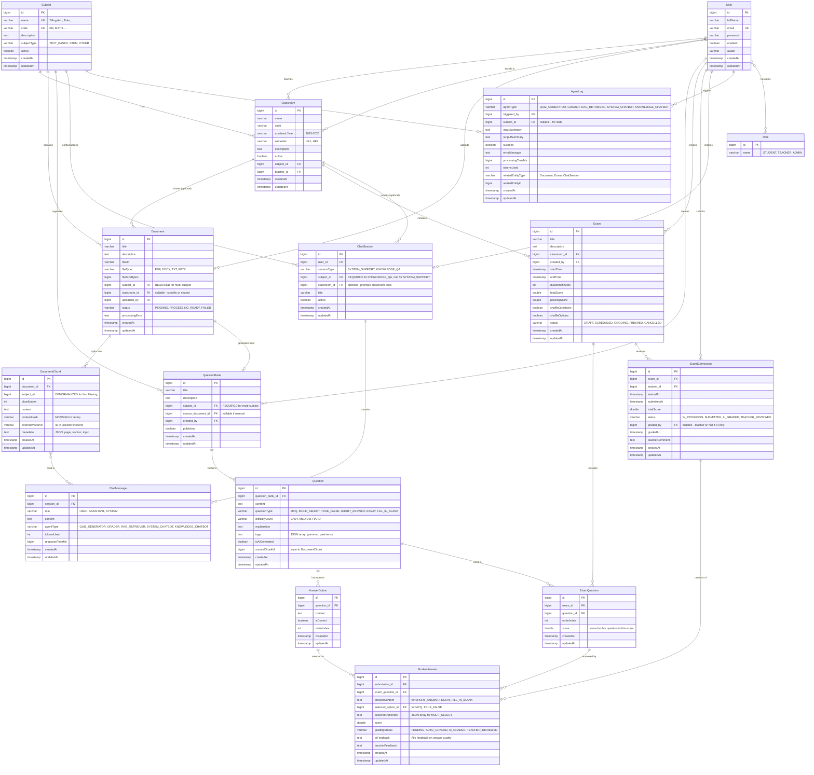

# Entity Relationship Diagram - Virtual Teaching Assistant System

## Sơ đồ quan hệ toàn bộ Entity



## Luồng dữ liệu chính

### 1. Upload tài liệu & RAG Pipeline
```
Teacher uploads Document (gắn Subject)
    ↓
Document.status = PROCESSING
    ↓
Text extraction & chunking
    ↓
DocumentChunk created (denormalized subject_id)
    ↓
Embedding generation
    ↓
Store in Vector DB (Qdrant/Pinecone)
    ↓
Save externalVectorId to DocumentChunk
    ↓
Document.status = READY
```

### 2. Tạo câu hỏi từ tài liệu
```
Teacher selects Document
    ↓
AI agent (QUIZ_GENERATOR) reads DocumentChunks
    ↓
Generate Questions → QuestionBank (gắn Subject)
    ↓
Teacher reviews & publishes
```

### 3. Tổ chức thi
```
Teacher creates Exam (linked to Classroom → Subject)
    ↓
Select Questions from QuestionBank (same Subject)
    ↓
Create ExamQuestion records (với điểm riêng)
    ↓
Students do exam → ExamSubmission
    ↓
StudentAnswer records created
    ↓
AI Grader agent chấm → aiFeedback
    ↓
Teacher reviews → teacherFeedback
```

### 4. Chat hỏi-đáp kiến thức
```
Student initiates ChatSession (KNOWLEDGE_QA, select Subject)
    ↓
Student asks question → ChatMessage (role=USER)
    ↓
RAG agent retrieves from Vector DB
    ↓
Filter: WHERE subject_id = {selected_subject_id}
    ↓
Top-K DocumentChunks → context
    ↓
LLM generates answer
    ↓
ChatMessage (role=ASSISTANT, sourceChunks linked)
```

---

## ⚠️ LƯU Ý QUAN TRỌNG VỀ VECTOR DB

### 🎯 Chiến lược lưu trữ Vector Embeddings

Có **3 phương án** chính:

#### **Phương án 1: PostgreSQL với pgvector extension** ⭐ Đơn giản nhất
```sql
-- Cài extension
CREATE EXTENSION IF NOT EXISTS vector;

-- Thêm cột vào DocumentChunk
ALTER TABLE document_chunks 
ADD COLUMN embedding vector(1536);  -- OpenAI ada-002: 1536 dimensions

-- Index cho similarity search
CREATE INDEX ON document_chunks 
USING ivfflat (embedding vector_cosine_ops)
WITH (lists = 100);
```

**Ưu điểm:**
- Không cần thêm service ngoài
- Đơn giản, dễ backup cùng DB chính
- Phù hợp hệ thống nhỏ/vừa (<1M vectors)

**Nhược điểm:**
- Performance kém hơn dedicated vector DB khi scale lớn
- Chiếm dung lượng PostgreSQL

**Cách filter theo Subject:**
```sql
SELECT * FROM document_chunks
WHERE subject_id = 1
ORDER BY embedding <=> '[0.1, 0.2, ...]'::vector
LIMIT 5;
```

---

#### **Phương án 2: Qdrant (dedicated vector DB)** ⭐ Khuyên dùng cho production

**Cấu trúc Collection trong Qdrant:**
```json
{
  "collection_name": "teaching_assistant_chunks",
  "vectors": {
    "size": 1536,
    "distance": "Cosine"
  }
}
```

**Payload khi insert vector:**
```json
{
  "id": "chunk_12345",  // UUID hoặc DocumentChunk.id
  "vector": [0.1, 0.2, 0.3, ...],  // 1536 dimensions
  "payload": {
    "chunk_id": 12345,
    "document_id": 100,
    "subject_id": 1,           // ⭐ KEY: filter theo môn học
    "classroom_id": 10,        // optional
    "content": "The present perfect tense...",
    "metadata": {
      "page": 5,
      "section": "Grammar Chapter 2"
    }
  }
}
```

**Query với filter Subject (Tiếng Anh = subject_id: 1):**
```python
from qdrant_client import QdrantClient
from qdrant_client.models import Filter, FieldCondition, MatchValue

client = QdrantClient("localhost", port=6333)

search_result = client.search(
    collection_name="teaching_assistant_chunks",
    query_vector=embedding_query,  # vector của câu hỏi
    query_filter=Filter(
        must=[
            FieldCondition(
                key="subject_id",
                match=MatchValue(value=1)  # CHỈ tìm trong môn Tiếng Anh
            )
        ]
    ),
    limit=5
)
```

**Lưu trong PostgreSQL:**
```java
@Entity
@Table(name = "document_chunks")
public class DocumentChunk extends BaseEntity {
    // ...
    
    @Column(length = 100)
    private String externalVectorId;  // Lưu ID trong Qdrant
    
    // Không cần cột embedding ở đây
}
```

**Ưu điểm:**
- Performance tốt, scale tốt (millions+ vectors)
- Hỗ trợ filter phức tạp
- Built-in cho vector search
- Open-source, tự host được

**Nhược điểm:**
- Cần thêm service riêng
- Phức tạp hơn về backup/sync

---

#### **Phương án 3: Pinecone (managed vector DB)** 💰 Dễ nhất nhưng mất phí

Tương tự Qdrant nhưng là SaaS. Filter theo `subject_id` trong metadata.

```python
import pinecone

index = pinecone.Index("teaching-assistant")

# Query with metadata filter
results = index.query(
    vector=embedding_query,
    filter={"subject_id": 1},  # CHỈ tìm môn Tiếng Anh
    top_k=5,
    include_metadata=True
)
```

---

### 🔥 THIẾT KẾ QUAN TRỌNG: Denormalized `subject_id` trong DocumentChunk

```java
@Entity
@Table(name = "document_chunks", indexes = {
    @Index(name = "idx_chunk_subject", columnList = "subject_id")  // ⭐ INDEX
})
public class DocumentChunk extends BaseEntity {
    @Column(name = "subject_id", nullable = false)
    private Long subjectId;  // DENORMALIZED từ document.subject.id
}
```

**Tại sao denormalize?**
- ✅ RAG query nhanh: `WHERE subject_id = 1` thay vì `JOIN documents JOIN subjects`
- ✅ Đồng bộ với filter trong Vector DB
- ✅ Khi học sinh hỏi môn Tiếng Anh → chỉ lấy chunks có `subject_id = 1`

**Đồng bộ dữ liệu:**
```java
// Khi tạo chunk từ Document
DocumentChunk chunk = DocumentChunk.builder()
    .document(document)
    .subjectId(document.getSubject().getId())  // ⭐ Copy subject_id
    .content(chunkText)
    .build();
```

---

### 📊 So sánh 3 phương án

| Tiêu chí | pgvector | Qdrant | Pinecone |
|----------|----------|--------|----------|
| **Độ phức tạp** | Thấp | Trung bình | Thấp |
| **Performance** | Tốt (<100K) | Xuất sắc | Xuất sắc |
| **Chi phí** | Miễn phí | Miễn phí (self-host) | $70+/month |
| **Filter môn học** | Native SQL | Native | Native |
| **Backup** | Cùng PostgreSQL | Riêng biệt | Managed |
| **Scale** | <1M vectors | 10M+ vectors | Unlimited |
| **Khuyến nghị** | Dev/MVP | Production | Enterprise |

---

### 🎯 KHUYẾN NGHỊ

**Giai đoạn 1 (MVP):** Dùng **pgvector**
- Đơn giản, ít dependency
- Đủ nhanh cho demo/pilot

**Giai đoạn 2 (Production):** Chuyển sang **Qdrant**
- Docker Compose:
```yaml
services:
  qdrant:
    image: qdrant/qdrant:latest
    ports:
      - "6333:6333"
    volumes:
      - ./qdrant_storage:/qdrant/storage
```
- Migration script: copy embeddings từ PostgreSQL → Qdrant
- Update `DocumentChunk.externalVectorId`

---

### 🔐 Bảo đảm tách biệt dữ liệu theo Subject

**Luôn luôn áp dụng filter `subject_id` khi:**

1. **RAG Query** (ChatSession KNOWLEDGE_QA):
```java
// Trong RAG Service
List<DocumentChunk> retrieveChunks(String query, Long subjectId) {
    // Nếu dùng pgvector:
    return chunkRepository.findTopKSimilar(queryEmbedding, subjectId, 5);
    
    // Nếu dùng Qdrant:
    Filter filter = Filter.must(FieldCondition.match("subject_id", subjectId));
    return qdrantClient.search(collection, queryEmbedding, filter, 5);
}
```

2. **Generate Questions từ Document:**
```java
// AI chỉ đọc chunks của document → tự động đúng subject
List<DocumentChunk> chunks = document.getChunks(); // Đã có subject_id
```

3. **Thống kê Agent Log:**
```sql
-- Thống kê agent nào được dùng nhiều nhất cho môn Tiếng Anh
SELECT agent_type, COUNT(*) 
FROM agent_logs 
WHERE subject_id = 1
GROUP BY agent_type;
```

---

## 🚀 Tóm tắt

1. **Entity `Subject`** là trung tâm phân loại → tất cả đều có chain về Subject
2. **`DocumentChunk.subjectId`** được denormalize để query nhanh + đồng bộ với Vector DB
3. **Vector DB phải hỗ trợ filter metadata** (`subject_id`) để tách biệt kiến thức các môn
4. **Khuyến nghị:** pgvector cho MVP → Qdrant cho Production
5. **KHÔNG BAO GIỜ** query vector mà không filter `subject_id` với KNOWLEDGE_QA session
